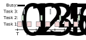
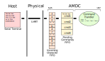

# Firmware Architecture - System

[Firmware Architecture](00-Firmware-Architecture.md)
- [Drivers](00a-Firmware-Arch-Drivers.md)
- **System**
- [User Applications](00c-Firmware-Arch-UserApps.md)

## Background

The AMDC firmware is designed to include a "system" layer which functions as a **simple** real-time operating system (RTOS). Read about RTOS design principles [on Wikipedia](https://en.wikipedia.org/wiki/Real-time_operating_system) before continuing...

What makes AMDC's RTOS design **simple**? Why is it used instead of a "real" RTOS (e.g. [FreeRTOS](https://www.freertos.org/))? What features does it expose to the user application? This document aims at answering these questions and more.

## System Design

The AMDC *system* layer sits between the *driver* layer and the *user application* layer. Some system resources (such as the serial interface) are managed exclusively by the system layer -- for example, if a user application needs to print a message to the console for debugging, it must request the system to do this action on its behalf (via the `sys/debug.c` module). Other system resources, such as PWM outputs or analog inputs, can be accessed directly by the user application via the driver layer.

### Tasks

Tasks are the foundation upon which all system services are built. As described in previous documentation, a task is simply a block of code that runs periodically. Tasks can exist in the user space (used in user applications) or in the system space.

Example tasks could be:
- `task1` runs at 1Hz and blinks an LED
- `task2` runs at 10kHz and regulates current through an RL load
- `task3` runs at 1kHz and handles serial communciation with UART interface

Each example task includes a frequency of operation as well as a "high-level" goal. Usually, the task has *state* that is updated each time the task is run. In `task1`, the state might be the current LED status (on/off). Each time `task1` is run, the LED state toggles and the LED is refreshed.

Notice how each task is independent -- they all run at different frequencies and do different things -- but together, they perform complex actions as a complete system. This is the crux of designing firmware to use a RTOS: splitting code into tasks which work together to solve a complex goal. You will need to do this when building user applications with AMDC.

#### Example



In the above diagram, three tasks are shown operating over time (referred to as T1, T2, and T3). T3, shown in red, operates every time slice and consumes nearly half the quantum. T2, shown in green, operates at half the frequency of T3 and consumes less computation time. Finally, T1, shown in blue, runs at a third the rate of T3 and only for little bursts of time.

Notice how the system is idle during the solid red regions on the top bar. Also, notice the inherit jitter in T1 -- the scheduler runs it during the correct time slices, but depending on T2, T1's periodicity changes slightly. During time slice 3, T1 occurs earlier in the time slice than in time slice 0 or 6. Jitter (or lack of) can be important in some applications and the developer must be aware of the system behavior.

#### Cooperation Between Tasks

The system scheduler (`sys/scheduler.c`) is responsible for running the registered tasks of the system. Tasks are **non-preemptable** by design. This means that once a task starts, it runs until it *yields* the processor -- it cannot be interrupted by the system. Imagine a task which has a lot of work to do. It gets scheduled to run by the scheduler and starts execution. **It then has complete control of the entire system.** It can choose to run as long as it wants. Only when it stops doing work and *yields* the processor does the scheduler regain control. At this point, the scheduler chooses another task to run and the cycle repeats.

Why is it important to understand that tasks are **non-preemptable**? Well, because of this fact, the scheduler is therefore designed for **cooperative** tasks (one would say that AMDC uses "cooperative scheduling"). The scheduler *relies* on the assumption that each task can be trusted -- no tasks are malicous and will take over the system by not yielding the processor. It is up to the developer to ensure this is true, otherwise the system will not operate correctly.

In practice, how does one create a cooperative task? This boils down to keeping tasks short. Only do a small amount of work, then stop and yield the processor. The maximum frequency of tasks (typically 10kHz) determines the total amount of time available for tasks during a time slice. At 10kHz scheduler frequency, the elementary time quantum is 100us. This means that all tasks registered with the scheduler must complete within 100us. Note that 100us is the *combined* time -- if there are 10 tasks that need to run at 10kHz, the total sum of the run time for each task must be less than 100us otherwise the scheduler time quantum will be overrrun. This is bad and should be avoided. 

What if a task must perform complex actions that take too long? If a task must do a lot of work, the developer must break up the work into small chunks, then perform each chunk of work during its own time slice. Breaking up work into small chunks is an advanced topic and will be covered in later documentation.

Read more about cooperative scheduling of tasks [on Wikipedia](https://en.wikipedia.org/wiki/Cooperative_multitasking).

### Commands

Commands provide interactive operation of AMDC with the outside world. While the hardware I/O allows AMDC to change state based on the physical world, commands are designed for higher-level actions (i.e., "turn off LED" or "spin motor to 100RPM"). Commands are completely optional in user applications and are triggered by user input on the serial terminal.

Example commands:
- `led toggle red` -- Toggle the red LED
- `motion rpm 100` -- Command a rotational speed of 100 RPM to a motion controller
- `motion bw 10` -- Set bandwidth of motion controller to 10 Hz
- `hw anlg read 0` -- Read hardware analog channel 0 voltage and display to terminal
- `hw pwm duty 2 50` -- Set PWM output 2 to duty ratio of 50%

Notice how commands are created by characters seperated by white space. The first chunk of characters is defined as the *base command*. For the above examples, base commands are `led`, `motion`, and `hw`. Subsequent sequences of characters seperated by white space are called *arguments* or *subcommands*.

#### Handling Commands

The commands system module (`sys/commands.c`) is responsible for parsing the characters from the terminal and calling the appropriate *command handler*. A command handler processes a single base command -- this includes all subcommands and arguments. Each base command is registered with the system during initialization and start-up so that the system knows it exists. All commands have a *help* message which the system will display if the user types "help".

The command handler signature follows standard C convention for the main function of a program called from the command line:

```C
int main(int argc, char **argv);
```

`argc` contains the number of arguments passed to the command. For example, if the user typed `cmd arg1 arg2`, `argc` would contain 3.

`argv` contains an array of character strings for each argument. For above example:
- `argv[0]` => `"cmd"`
- `argv[1]` => `"arg1"`
- `argv[2]` => `"arg2"`

#### Command Flow

When the user types a command into the terminal, a complex set of operations is set in motion (see implementation in `sys/commands.c`). Below is a diagram of the flow of each character the user types. When developing user applications that include commands, the developer does not need to worry about the following information, as they simply implement the commmand handler (shown in green below). For completeness, the following discussion is presented as explanation for how the user-supplied command handler is (eventually) called.



What happens when a character is entered into the terminal? The user terminal reads the input character and sends it to the driver on their PC which talks with the USB-UART device on AMDC. The character is then sent over the physical medium to the AMDC hardware. The UART hardware peripherial buffers incoming characters in a small FIFO (first-in, first-out) structure (referred to as simply FIFO).

At this point, the system firmware begins. The UART FIFO is drained and the incoming characters are copied into a much larger queue structure in system memory (shown in orange above). A task then runs periodically to parse these characters and form pending commands which get placed in another system level FIFO. Yet another task then runs each pending command in its own scheduler time slice, which calls the user defined command handler. The `argv` argument of the command handler now points to characters which reside in the orange incoming characters FIFO.

These layers of communication, FIFOs, and queues are used to provide hard guarantees about system performance. They enforce the following:
- A single valid command is run during each time slice
- Commands have a limited number of arguments
- Each argument has a limited length
