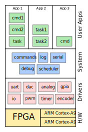

# Firmware Architecture

**Firmware Architecture**
- [Drivers](00a-Firmware-Arch-Drivers.md)
- [System](00b-Firmware-Arch-System.md)
- [User Applications](00c-Firmware-Arch-UserApps.md)

## Motivation

This document outlines the AMDC firmware architecture. By understanding the high-level concepts, it will make reading the code and writing custom applications much easier. Care has been taken to ensure that users will not need to "reinvent the wheel" -- common systems like command processing, task management, and logging have been built into the architecture.

## Layers of Abstraction

A good software system has many layers of abstraction. The client of one subsystem does not need to know how that subsystem works interally -- he simply uses the interface provided and expects that it works as specified. The AMDC firmware is structured in this manner.

## Hardware

All firmware runs on the AMDC controller board, the [PicoZed](http://zedboard.org/product/picozed), which in turn runs on a [Xilinx Zynq-7000 SoC](https://www.xilinx.com/products/silicon-devices/soc/zynq-7000.html). This SoC is very powerful -- it contains dual core ARM Cortex-A9 processors along with tightly integrated FPGA fabric.

### ARM Cortex-A9 Processors

The Cortex-A9 processors (referred to as digital signal processors, DSPs) are responsible for running the actual C code. Most user firmware development of control algorithms will be in C and run on the DSP.

### FPGA

The tightly integrated FPGA exists "next" to the DSPs, and acts like a huge custom peripherial for the DSPs. Users can develop any custom digital circuitry and access it from the C code. This is very powerful and can be used to implement almost anything:
- Fast, high-bandwidth I/O to PCB level devices
- Accelerators which assist firmware by offloading computation to hardware

## Drivers

All firmware drivers are located in the `drv` directory. These modules are responsible for commuicating with hardware devices. Driver modules provide a layer of abstraction between system / user code and hardware resources. Users will need to access hardware resources regulary (i.e. to update PWM duty ratios or read in an analog value). By using the provided drivers, this interaction is made easy.

Most of the system hardware peripherials are located in the FPGA and are custom for the AMDC PCB. This includes the PWM generation, interface to the ADCs for analog measurement, GPIOs, encoder, etc. To control these FPGA modules, registers are read / written from C. The C firmware must know the addresses of these registers to access the data they want. Instead of putting this burden on each user who is trying to use AMDC, the drivers take care of this. The user can use "high-level" commands with the driver -- i.e., "set the PWM duty ratio to 50% for output 1".

As an example, consider trying to use an FPGA timer. The timers can be configured to trigger interrupts from the FPGA. The `drv/timer.c` driver abstracts away the fairly complex task of initializing the FPGA hardware and setting up register values. Instead, the user can essentially command: "set up timer 1 to trigger interrupt at 10kHz" and it automagically happens. :)

[Read more about the driver layer...](00a-Firmware-Arch-Drivers.md)

## System

All firmware system code is located in the `sys` directory. These modules are responsible for "system" level subsystems. The AMDC firmware system code is designed to behave similar to a [Real-Time Operating System (RTOS)](https://en.wikipedia.org/wiki/Real-time_operating_system), but without the added complexity of a full RTOS.

[Read more about the system layer...](00b-Firmware-Arch-System.md)

## User Apps

All user apps are written in C and exist in the `usr` directory. These apps are built on top of all other system functionality (the system modules, drivers, and hardware). These user apps interact with the system code for various things: register tasks, register commands, etc. The user apps can also interact with the system drivers to interface with hardware resources (i.e., PWM outputs, analog inputs, etc).

[Read more about the user application layer...](00c-Firmware-Arch-UserApps.md)

To understand how to create an application for AMDC, you must fully grasp the following concepts: *tasks* and *commands*.

### Tasks

The AMDC firmware is mainly *task based*. These tasks are repeatedly executed at user-specified intervals (i.e., 1Hz, 500Hz, 10kHz, etc). You can think of a task as simply a block of code that runs periodically. These tasks can form the backbone of a user control algorithm. For example, imagine a PID controller. This code must be executed periodically to update its state. This would fit naturally into a **task** -- the user can configure the system to run the controller task at a periodic interval so that the state updates.

[Read more about tasks...](00b-Firmware-Arch-System.md#tasks)

### Commands

To interact with the firmware which is running on AMDC, a command-line interface is used. The user types commands into the terminal and the firmware responds and performs the desired actions. There are several built-in commands on AMDC, for example, the `hw` command allows the user to access various hardware systems like PWM and analog.

However, each user application will most likely require its own commands in addition to the default system commands. For example, if an application is controlling a motor, having a command to set the desired output shaft speed would be helpful. The system `commands.c` module exists for this purpose -- the user application simply registers their own command with the system. The user does not need to understand how the incoming characters are parsed and handled -- the system will call the user command handler function if their command has been typed in.

[Read more about commands...](00b-Firmware-Arch-System.md#commands)

## Examples

To fully grasp the AMDC firmware architecture, examples are provided which concretely show the ideas presented above. See the example application: [`blink`](../sdk/bare/usr/blink/).
