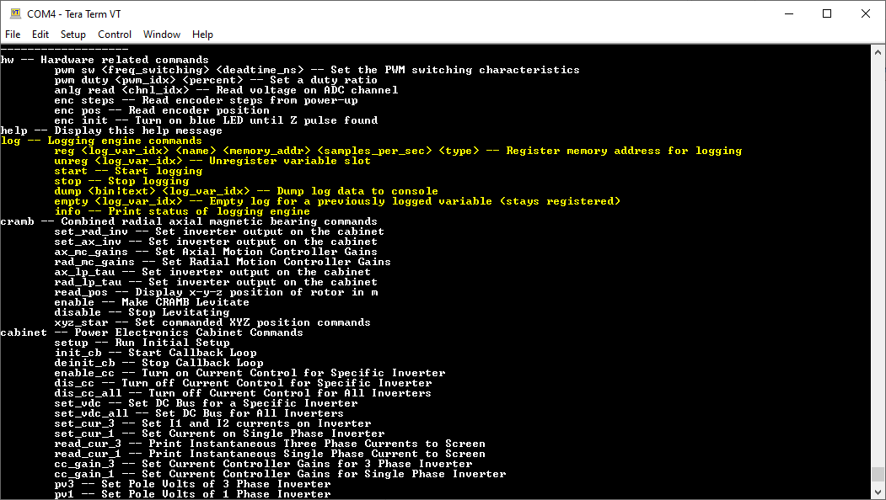

# Logging with the AMDC
The ability to log and extract variables of interest out of the AMDC is a critical feature needed for debugging, testing, and general data recording. Because of this, the AMDC has logging capabilities built into the firmware and can record up to 32 variables. The intent of this document is to show a user how to implement logging in their code. 

There are two interfaces that can be used for logging: 1) the standard serial terminal interface that is typically used with user commands (logging can be thought of as an application that can be included in your project) and 2) a Python interface that is built on top of and wraps the serial interface. It is highly recommended that users use the Python interface as it provides certain convenience methods and abstractions that make logging much more intuitive and less error prone.

## General Flow

The general flow for logging data in the AMDC is simple and uses the procedure shown below. Note that steps 2-5 are done through the python interface:

1. Set up user C-code for logging
1. Register variable(s) to log
1. Start logging
1. Stop logging
1. Dump the collected data

## Internal Workings

Internally...

## C-Code Modifications

The firmware has been design specifically to limit the amount of changes users have to make to their C-code to log variables of interest. The only modifications that users need to make to their C-code are as follows:

1. For every variable that you want to log within your code, create a new global variable with the same name prepended by `LOG_` (note that it is case sensitive). For example, if you have a variable `foo` in your code that you would like to log, create a new global variable of the same type called `LOG_foo`.

1. Update all global logging variables wherever desired by assigning the local variable to the global variable (e.g. `LOG_foo = foo;`)

#### Example
The following example illustrates one possible use case:

We have a typedef called `Currents_t` that is a struct containing measured currents from each of the three inverter phases. This variable is then updated by the generic `read_currents` function. You could imagine this function reading in the three current sensors from an inverter. We wish to log the three phase currents. To do this we use the two steps listed above. First we create global variables for each of the three currents that we care about. Then in the callback function we update the global current variables to equal the measured currents that we care about tracking. Note that in this example we update the global variables within the callback but you can update them at any point in your code. For example, we could have updated the global variables inside of the `read_currents()` function

```
double LOG_Ia = 0.0;
double LOG_Ib = 0.0;
double LOG_Ic = 0.0;

typedef struct Currents_t {

    double Ia;
    double Ib;
    double Ic;

} Currents_t;

static Currents_t Iabc = {0.0, 0.0, 0.0};

void callback_func(){

    //read currents from sensors
    read_currents(&Iabc);
    
    //updating variables that are being recorded by logging application
    LOG_Ia = Iabc.Ia;
    LOG_Ib = Iabc.Ib;
    LOG_Ic = Iabc.Ic;
}
```

## Terminal Interface

The terminal interface operates the same as any other user application (as shown below). It is highly recommended, however, that the user does not use the terminal interface directly, as it is difficult to use and requires a lot of book keeping. The following documentation will describe each of terminal commands, but is primarily just for completeness of the documentation.



The logging application has the following commands:

1. `reg` -- registers a new variable for logging
    > **Required Arguments**  
    > - `log_var_idx` -- the index that you want the variable to be stored in (must be 0-31). The command will fail if a variable is already registered in the requested slot.
    > - `name` -- name of the variable that you are logging (example: `LOG_foo`)
    > - `memory_addr` -- global memory address of the variable you are logging in decimal format. The reason global variables are created for logging is because their address remains constant at runtime. The memory address can be found in "mapfile.txt" in a hexadecimal format, which is located in the "Debug" folder of the users private c code. After locating the variable's address, you must convert it from hexadecimal to decimal before entering it in the terminal.
    > - `samples_per_sec`  -- the sample rate in samples per second that you wish to record the variable at. Note that not all variables have to have the same sample rate.
    > - `type` -- data type of the variable being logged. Valid types are: `double`, `float`, `int` 

2. `unreg` -- unregisters a variable that you no longer care to log  
    > **Required Arguments**  
    > - log_var_idx -- the index of the variable that you want to unregister (must be 0-31).
    
3. `start` -- starts recording data  
    
4. `stop` -- stops recording data  
    
5. `dump` -- dumps all of the recorded data of a slot out to the serial terminal  
    > **Required Arguments**  
    > - `bin` or `text` -- One of the preceding flags must be set. If `bin` is used, the data will be dumped to the serial terminal in binary format. If `text` is used, the data will be dumped to the serial terminal in human readable text format. Using `bin` is much faster.
    > - `log_var_idx` -- index of the variable that you wish to dump (must be 0-31)
    
6. `empty` -- resets the index of a logging slot (calling `dump` after `empty` on the same slot will result in no data being output)  
    > **Required Arguments**  
    > - `log_var_idx` -- index of the variable you wish to reset
    
7. `info` -- prints information about what variables are being logged and what slots are taken to the serial terminal  

## Python Interface

Before you can use the python interface, you must modify your c code according to the C-Code Modifications [section](#c-code-modifications).

1. Instantiate a logger object
1. Synchronize logger with AMDC
1. Register variables of interest
1. Clear logged variables
1. Start logging
1. Stop logging
1. Log for set duration
1. Dump data
1. Unregister Variables
1. Load saved data
