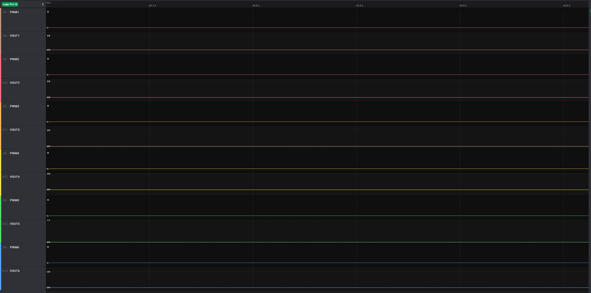
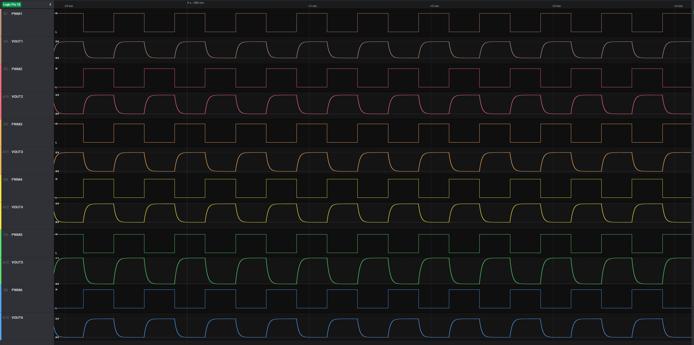
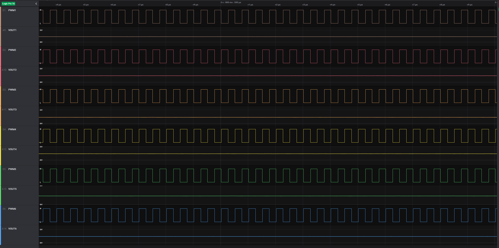
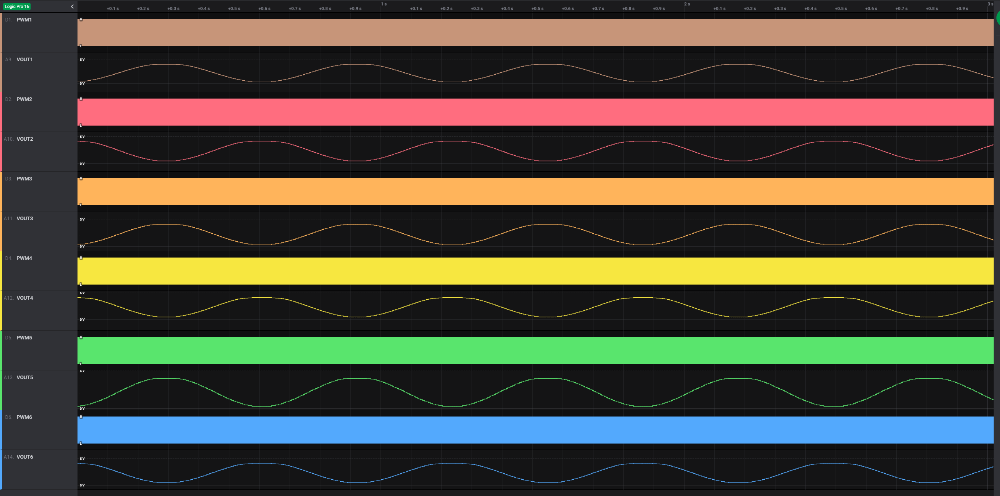
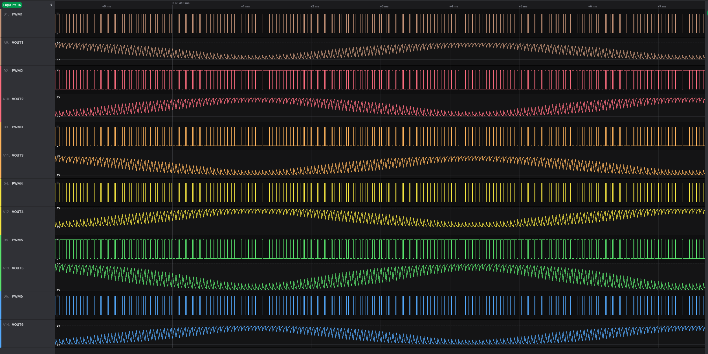

# AMDC TestBoard Usage

This document describes the AMDC TestBoard and the things for which it can be used. The necessary hardware setup is outlined and experimental waveforms are shown. Several practical use cases are outlined.

Note that the TestBoard, and therefore this entire document, is only applicable to / supported by AMDC REV D hardware.

## Hardware Setup

To use the TestBoard, you will need to plug it into the AMDC. This requires four analog cables (like Ethernet cables) and one power stack cable (high density DB15 cable).

If you need to buy cables, see some recommended options [here](https://github.com/Severson-Group/AMDC-Hardware/tree/develop/Accessories/TestBoard/REV20200624A#recommended-cables).

#### AMDC Analog Port Connections

The AMDC has a 2x2 RJ45 jack which the analog input voltages are read from. The TestBoard has the same jack. Use the four ethernet cables to connection these two jacks together.

When looking at the jacks from the front, the locations match on the AMDC and TestBoard. For example, the top left port on the AMDC connects to the top left port on the TestBoard.

#### AMDC PowerStack Port Connection

The AMDC has eight PowerStack ports on the front, arranged in four stacks of two DB15 connectors. The TestBoard has a single DB15 connector. Plug in the DB15 cable into one of the eight AMDC PowerStack ports. Plug the other end into the TestBoard.

Reminder: To enable the PWM outputs on the AMDC, the user must configure the AMDC `VDRIVE` voltage properly, as well as the E-STOP input. The appropriate `VDRIVE` voltage for the TestBoard is between 5V and 10V. **Do not exceed 10V on `VDRIVE` when using the TestBoard**. The AMDC PWM outputs are enabled if the E-STOP input is shorted. All PWM outputs go to the logic LOW state when the E-STOP is opened.

#### TestBoard Configuration

The TestBoard has a few jumpers which need to be configured.

Ensure the DIP switches are in the OFF position (i.e. the switches are open).

Ensure only one jumper (or no jumper) is installed across JP1 to JP6. This jumper connects the `VOUT` analog voltage to the BNC jack on the TestBoard. If you are not using the BNC jack, this jumper is optional.

## Use Case #1: TestBoard as DAC

One of the features of the TestBoard is that it has RC filters attached to each of the six PWM outputs from the PowerStack port. These RC filters convert the digital PWM signals to analog voltages based on the duty ratios which the AMDC is outputting as well as the `VDRIVE` voltage level which the user has supplied the AMDC.

For example, if `PWM1` is at 0% duty ratio, the analog voltage on `VOUT1` should be 0V. When `PWM1` is at 100% duty ratio, `VOUT1` should be equal to `VDRIVE`. However, due to PWM dead-time, a small offset must be subtracted.

Therefore, the equation for VOUT is written as:

*VOUT = (VDRIVE * pwm_duty_ratio) - small_offset_due_to_deadtime*

From the above discussion, it should be obvious that the TestBoard can act as a simple digital to analog (DAC) device. The user can write the desired analog voltage value to the PWM duty ratio (as a percent of VDRIVE). That voltage will appear on the TestBoard.

#### PWM Switching Effects

Since VOUT is simply an RC filtered version of the raw PWM signal, the PWM switching parameters will heavily affect the analog voltage output, VOUT. The default values for the RC filters on the TestBoard are tuned to 10kHz bandwidth.

As PWM switching frequency increases, the voltage ripple on VOUT will decrease. As PWM dead-time increases, the subtracted voltage offset will increase.

The user can configure the PWM switching parameters on the AMDC using the `hw pwm sw ...` command.

```
# Set the PWM to 100kHz and 100ns of deadtime
hw pwm sw 100000 100

# Enable PWM output
hw pwm on

# Disable PWM output
hw pwm off
```

The AMDC limits the PWM output frequency between 2kHz and 2MHz. It limits the minimum dead-time to 25ns.

**When using the TestBoard as a DAC (and nothing else plugged into the inverter ports), configure the PWM switching parameters to 2MHz with 25ns of deadtime. This will result in the smoothest analog VOUT.**

### Example Waveforms

In the waveforms shown between, all six digital PWM testpoints (TP2 to TP7) on the TestBoard are measured as well as all six analog testpoints (TP16 to TP21). The waveforms are labeled on the left-hand side.

VDRIVE is 5V.

#### PWM Disabled



#### PWM Enabled (50% Duty Ratio)

50% duty ratio output on all channels at several PWM switching parameter points.

##### Fsw = 2kHz, Tdt = 25ns



##### Fsw = 100kHz, Tdt = 100ns


##### Fsw = 2MHz, Tdt = 25ns



#### Sinusoid Generation

Firmware task updating PWM duty ratios to create three-phase sinusoidal output on TestBoard VOUT.

##### Fsw = 2MHz, Tdt = 25ns

_VOUT = cos(10*t)_



##### Fsw = 20kHz, Tdt = 25ns

_VOUT = cos(1000*t)_



