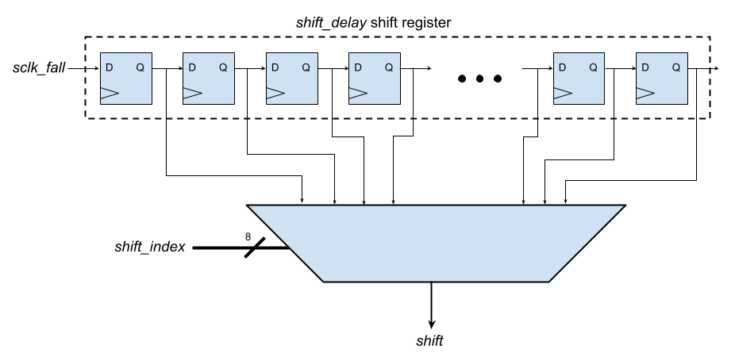
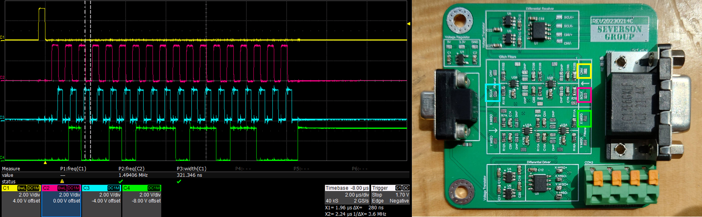

# AMDC IP: `amdc_eddy_current_sensor_1.0`

This IP core is a driver for the digital interface of the eddy current sensor used for levitation control in the CRAMB. The IP is designed as the SPI master to the dual [AD4011](https://www.analog.com/media/en/technical-documentation/data-sheets/AD4003-4007-4011.pdf) ADCs that are integrated into the eddy current sensor.

## Features

- Configurable sample rate synced to AMDC PWM Carrier
- 500 kHz - 10 MHz SPI clock
- 3-Wire operation 

More details specific to the ADC timing requirements can be found in the [datasheet](https://www.analog.com/media/en/technical-documentation/data-sheets/AD4003-4007-4011.pdf)
    
## IP Interface

The IP is accessed via the AXI4-Lite register-based interface from the DSP. This interface retrieves X and Y positional data from the eddy current sensor through control of its integrated ADCs

## Register Map

| Offset | Name | R/W | Description |
| -- | -- | -- | -- |
| 0x00 | SENSOR_DATA_X | R   | IP Data Register |
| 0x04 | SENSOR_DATA_Y | R   | IP Data Register |
| 0x08 | SPI_DIVIDER   | R/W | IP Configuration Register |
| 0x0C | PWM_TRIGGERS  | R/W | IP Configuration Register |
| 0x10 | SHIFT_INDEX   | R/W | IP Configuration Register |

### SENSOR_DATA_X
| Bits | Name | Description |
| -- | -- | -- |
| 31:18 | SIGN_EXT | Sign extended bit 17 |
| 17:0  | DATA | 2's compliment 18 bit positional data of the X direction |

### SENSOR_DATA_Y
| Bits | Name | Description |
| -- | -- | -- |
| 31:18 | SIGN_EXT | Sign extended bit 17 |
| 17:0  | DATA | 2's compliment 18 bit positional data of the Y direction |

### SPI_DIVIDER
| Bits | Name | Description |
| -- | -- | -- |
| 7:0 | DIVIDER | SCLK will toggle after a number of FPGA CLK cycles equal to this register value.   The default is 50: since the FPGA CLK period is 5ns, this will be 250ns high/250ns low, or 2 MHz for SCLK |

### PWM_TRIGGERS
| Bits | Name | Description |
| -- | -- | -- |
| 0 | PWM_HIGH_TRIGGER | If this bit is 1, a conversion/acquistion cycle will be triggered when the PWM carrier hits its max value (default 1) |
| 1 | PWM_LOW_TRIGGER | If this bit is 1, a conversion/acquistion cycle will be triggered when the PWM carrier hits its min value (default 1) |

### SHIFT_INDEX
| Bits | Name | Description |
| -- | -- | -- |
| 7:0 | SHIFT_INDEX | Which flip-flop in the `shift_delay` shift register we should use as our actual `shift` signal.   This is needed to delay our shifting to align with the Kaman adapter board's propogation delay. See below. |

#### Propogation Delay and Shift Index

The [Kaman Adapter Board](https://github.com/Severson-Group/AMDC-Hardware/tree/develop/Accessories/Kaman_IO_ConverterBoard) has two filtering lanes (from the AMDC/FPGA side to the Kaman ADC, and vice-versa). These two filtering lanes are each comprised of two Schmitt-Trigger glitch filter ICs, as well as some RC filtering. This causes significant signal propogation delay between SCLK being generated on the FPGA side, and the response from the Kaman device on the X/Y MISO lines to make their way back to the FPGA to be sampled.

To correct for this propogation delay and shift the new bits on the MISO lines into the X/Y data registers at the correct time, the `shift_delay` shift register was created. This shift register takes in the `sclk_fall` signal (which is when we would want to shift in our data bits if there was no delay), and shifts it through the chain. The value `shift_index` is used to select which flop is used for the final `shift` signal (or in other words, how much delay is needed).

This `shift_index` value is its own register, and is configured by writing to the register via the C code driver function `eddy_current_sensor_set_timing()` found in [sdk/app_cpu1/common/drv/eddy_current_sensor.c](https://github.com/Severson-Group/AMDC-Firmware/blob/v1.0.x/sdk/app_cpu1/common/drv/eddy_current_sensor.c). The driver calculates the required value of `shift_index` using the user-specified SCLK frequency and one-way Kaman Adapter Board propogation delay.

The one-way propogation delay can be measured on the scope by looking at the delay between the two SCLK test points (pink and blue in the image below). On a Kaman Adapter Board built to match the [REV C schematic](https://github.com/Severson-Group/AMDC-Hardware/blob/develop/Accessories/Kaman_IO_ConverterBoard/REV20230213C/IO_Converter_Board_Sch.pdf), one-way delay should be ~270 nanoseconds, so this is the default value used by the driver. The cursor in the image below shows this delay between two falling edges of SCLK. Yellow is the CNV line to the ADC in the Kaman device, and green is the X MISO line on the FPGA side, which is significantly delayed from the pink SCLK (also on the FPGA side)

Once the propogation delay (in nanoseconds) is measured, and the desired SCLK frequency (in Megahertz) is selected, the driver calculates the required `shift_index` to write to the IP by multiplying the one-way propogation delay by two for the round-trip delay, adding half of the SCLK period (to shift on the center of the bit), and dividing by the FPGA clock frequency to determine how many flops the `sclk_fall` signal needs to propogate through before the MISO data is valid to shift in.