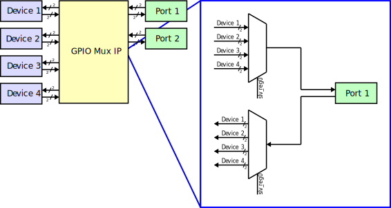

# AMDC IP: `amdc_gpio_mux_1.0`

This IP core is a mux for the GPIO lines on the IsoSPI (GPIO) ports. It allows remapping of internal FPGA device driver signals from internal device IP's to either of the two IsoSPI ports. 
## Features

- Remap IsoSPI ports GPIO lines
- Configurable in real time using the CLI

## IP Interface

The IP is accessed via the AXI4-Lite register-based interface from the DSP.

## Register Map

| Offset | Name | R/W | Description |
| -- | -- | -- | -- |
| 0x00 | PORT1_GPIO_SEL | W | Mux selector for port 1|
| 0x04 | PORT2_GPIO_SEL | W | Mux selector for port 2|
|----- | Unused | W | Reserved for future use |
| 0x7C | Unused | W | Reserved for future use |

### Register: `PORTn_GPIO_SEL`
| Bits | Name | Description |
| -- | -- | -- |
| 31:0 | DATA | Unsigned number from 0 to 4  - indicates which device drivers are connected IsoSPI port _n_   - Value of 0 designates port _n_ as unused and all outputs will be held to logic low

## Connecting IP Block

User IP blocks must be connected to the GPIO mux IP in the block diagram. The connections should be made to the `device_in_n` and `device_out_n` ports on the GPIO mux IP block. All input ports that are unused must be connect to logic 0 in the block diagram therefore some `device_out_n` ports may be connected to logic 0. These connections can be replaced with a connection to the user IP block. If only a single pin is being used on the GPIO port, a specific bit can be ripped from the port by using the built-in [Slice](https://www.xilinx.com/support/documentation/ip_documentation/xilinx_com_ip_xlslice/v1_0/pb042-xilinx-com-ip-xlslice.pdf) Vivado IP block. Likewise, user IP blocks that share the same GPIO port can be merged together using the [Concat](https://www.xilinx.com/support/documentation/ip_documentation/xilinx_com_ip_xlconcat/v2_1/pb041-xilinx-com-ip-xlconcat.pdf) Vivado IP block. 

## C drivers

The drivers used to configure this IP core can be found [here](../../sdk/bare/common/drv/docs/GPIO-Mux.md). 
