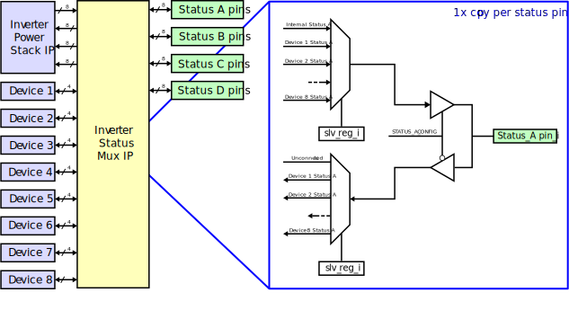

# AMDC IP: `amdc_inv_status_mux_1.0`

This IP core is a mux for the status lines on the Inverter Power Stack ports. It allows remapping of the internal FPGA status line signals from internal device IP's to any arbitrary status line pin. The direction of the pins can be configured as input or output. 
## Features

- Remap Inverter Power stack ports status lines
- Configure direction of status lines
- Configurable in real time
    

## IP Interface

The IP is accessed via the AXI4-Lite register-based interface from the DSP.

## Register Map

| Offset | Name | R/W | Description |
| -- | -- | -- | -- |
| 0x00 | PORT1_STS_A_SEL | W | Mux selector for Status A output on port 1 and Status A input on Device 1 |
| 0x04 | PORT2_STS_A_SEL | W | Mux selector for Status A output on port 2 and Status A input on Device 2 |
|----- | PORTn_STS_A_SEL | W | Mux selector for Status A output on port n and Status A input on Device n |
| 0x1C | PORT8_STS_A_SEL | W | Mux selector for Status A output on port 8 and Status A input on Device 8 |
| 0x20 | PORT1_STS_B_SEL | W | Mux selector for Status B output on port 1 and Status B input on Device 1 |
| 0x24 | PORT2_STS_B_SEL | W | Mux selector for Status B output on port 2 and Status B input on Device 2 |
|----- | PORTn_STS_B_SEL | W | Mux selector for Status B output on port n and Status B input on Device n |
| 0x3C | PORT8_STS_B_SEL | W | Mux selector for Status B output on port 8 and Status B input on Device 8 |
| 0x30 | PORT1_STS_C_SEL | W | Mux selector for Status C output on port 1 and Status C input on Device 1 |
| 0x34 | PORT2_STS_C_SEL | W | Mux selector for Status C output on port 2 and Status C input on Device 2 |
|----- | PORTn_STS_C_SEL | W | Mux selector for Status C output on port n and Status C input on Device n |
| 0x5C | PORT8_STS_C_SEL | W | Mux selector for Status C output on port 8 and Status C input on Device 8 |
| 0x50 | PORT1_STS_D_SEL | W | Mux selector for Status D output on port 1 and Status D input on Device 1 |
| 0x54 | PORT2_STS_D_SEL | W | Mux selector for Status D output on port 2 and Status D input on Device 2 |
|----- | PORTn_STS_D_SEL | W | Mux selector for Status D output on port n and Status D input on Device n |
| 0x7C | PORT8_STS_D_SEL | W | Mux selector for Status D output on port 8 and Status D input on Device 8 |
| 0x80 | STATUS_A_CONFIG | W | Configures the direction and source of status A lines |
| 0x84 | STATUS_B_CONFIG | W | Configures the direction and source of status B lines |
| 0x88 | STATUS_C_CONFIG | W | Configures the direction and source of status C lines |
| 0x8C | STATUS_D_CONFIG | W | Configures the direction and source of status D lines |

### Register: `PORTn_STS_x_SEL`
| Bits | Name | Description |
| -- | -- | -- |
| 31:0 | DATA | Unsigned number from 0 to 8  - status _x_ is an output: indicates which internal device output is assigned to status _x_ port _n_  - status _x_ is an input: indicates which external status _x_ port _n_ is assigned to internal device _n_ input  - Value of 0 assigns the status _x_ port _n_ to the internal status _x_ port _n_ pin from the Inverter Power Stack IP core

### Register: `STATUS_x_CONFIG`
| Bits | Name | Description |
| -- | -- | -- |
| 0 | DIRECTION | Designates the direction of all status _x_ pins (0 for input, 1 for output) |

## C drivers

The drivers used to configure this IP core can be found [here](../../sdk/bare/common/drv/docs/Status-Mux.md). 
