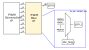

# IP: `amdc_pwm_mux_1.0`

This IP core is a simple mux for the PWM output pins. It allows remapping of the internal FPGA PWM signals to any arbitrary PWM output pin.

## Features

- Configurable at run-time
- Remap PWM signals to any PWM output pin

## IP Interface

The IP is accessed via the AXI4-Lite register-based interface from the DSP.

## Configuration

This IP has no build-time configuration parameters.

## Register Map

This IP block contains 50 slave registers.

| Offset | Name | R/W | Description |
| -- | -- | -- | -- |
| 0x00 | PWM_MUX_SEL0 | RW | Mux selector for PWM output pin 0 |
| 0x04 | PWM_MUX_SEL1 | RW | Mux selector for PWM output pin 1 |
| 0x08 | PWM_MUX_SEL2 | RW | Mux selector for PWM output pin 2 |
| 0x0C | PWM_MUX_SEL3 | RW | Mux selector for PWM output pin 3 |
| 0x10 | PWM_MUX_SEL4 | RW | Mux selector for PWM output pin 4 |
| .... | PWM_MUX_SELn | RW | Mux selector for PWM output pin n |
| 0xBC | PWM_MUX_SEL47 | RW | Mux selector for PWM output pin 47 |
| 0xC0 | PWM_MUX_UNUSED1 | RW | Unused register |
| 0xC4 | PWM_MUX_UNUSED2 | RW | Unused register |

### Register: `PWM_MUX_SEL*`

| Bits | Name | Description |
| -- | -- | -- |
| 31:0 | DATA | Unsigned number (0 to 47) which indicates which internal PWM signal to assign to PWM output pin _n_ |

## Testing

This IP has been tested on the AMDC REV D hardware target.
