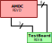

# PCB Test Application

This user application (`pcbtest`) implements a test suite to validate the functionality of the PCB hardware. The user should run this app on a new AMDC board after manufacturing to ensure the PCB components are soldered correctly.

## Supported Hardware

This application only supports the [AMDC REV D](https://github.com/Severson-Group/AMDC-Hardware/tree/develop/REV20200129D) target combined with the [REV A TestBoard](https://github.com/Severson-Group/AMDC-Hardware/tree/develop/Accessories/TestBoard/REV20200624A).

## Hardware Set-Up

This application is designed for a specific hardware set-up. The TestBoard must be plugged into the AMDC:

1. All eight AMDC analog inputs must be connected using four Ethernet cables to the TestBoard. When looking straight at the 2x2 RJ45 connector, the cable locations match on the TestBoard and the AMDC.
2. One DB15 cable must be plugged into the AMDC PowerStack ports as well as the TestBoard "Inverter Link" port.



On the TestBoard, `PWM[1..6]` from the power stack port are connected across first-order RC filters. The filtered PWM voltage then goes back into the AMDC analog inputs on `ANALOG IN[1..6]`. This creates a "loop-back" topology. The TestBoard also supplies +/- 10V to the AMDC on channels `ANALOG IN[7..8]`.

## Available Commands

`test analog` - *Print all analog voltages to screen*

`test auto <quiet|loud> <num_passes> <#[T|B]> <VDRIVE>` - *Perform automated test of specified power stack port (e.g. 1T is top-left)*
    
## Manual Test

The user can manually test the AMDC hardware PWM outputs as well as the analog inputs. The following procedure outlines the test:

### 1. Verify AMDC +/- 15V rails are operational

When the AMDC firmware starts running, it defaults to turning off all PWM. This means that all switches are open. Verify this by calling `test analog`.

The expected output is that the first 6 channels are at 0V and the last two are at +/- 10V. If this is not the case, stop testing and fix the +/- 15V rails on the AMDC.

### 2. Verify PWM output + analog input

Next, turn on AMDC PWM by calling `hw pwm on`. This enables PWM switching at: `Fsw = 100kHz`, `Tdt = 100ns`. It sets all outputs to 50% duty ratio.

Verify this by calling `test analog`. The expected output is that the first six voltages are at `+/- VDRIVE / 2` and the last two are +/- 10V.

You may see noise when calling `test analog` repeatedly. Try changing the PWM parameters to `Fsw = 400kHz` and `Tdt = 25ns`. Note that PWM parameters can only be changed when PWM is off.

## Automated Test

The real power of the `pcbtest` application is the automated test functionality. This is used to verify that both the PWM outputs and analog inputs work correctly, just like previous section. However, the automated test can perform 100s of unique tests very quickly to fully validate the hardware. After running, a smart debug message is given which directs the user at the specific PCB nets which are potentially broken. If no hardware issues are detected, the test passes.

### Using the automated test feature

1. Plug the AMDC into the TestBoard (all eight analog channels and one power stack port).
2. Supply the AMDC a stable `VDRIVE` input and ensure the `E-STOP` input is not activated (i.e. PWM can be active).
3. Run the `test auto ...` command.

The `test auto ...` command will perform numerous tests are automatically report the status of the hardware.

Note that the user does not have to set-up the PWM peripheral -- the `pcbtest` application will do this automatically.

#### Parameters for `test auto ...`

- `<quiet|loud>` - Run the test in either `quiet` or `loud` mode. Individual test results are printed to the console in `loud` mode, while only the final hardware status results are printed in `quiet` mode.
- `<num_passes>` - Specify the number of passes which the automated test makes per PWM output pair. This should be between 100 and 500.
- `<#[T|B]]>` - Specify which power stack port the TestBoard is plugged in to. When looking at the AMDC, the left DB15 stack is `1` and the right stack is `4`. The top port is `T` and the bottom is `B`. For example, the further right, bottom port is called `4B` while the middle-right top port is called `3T`.
- `<VDRIVE>` - Specify the `VDRIVE` voltage (in V) which the AMDC is supplied. A typical value of 5V requires the input of `5`. Only use 5V to 10V `VDRIVE` supplies for this test.

#### Example

To test the top-left power stack port when using 5V VDRIVE, run the following command:

```
test auto quiet 100 1T 5
```

### Example output (all hardware working)

The automated test was run on working hardware using: `test auto loud 1 1T 5`

```
test auto loud 1 1T 5
SUCCESS

Automated PCB Test: Inverter Port 1T
------------------------------------
Test started...
        PASS: +10V rail reads  10.0075V
        PASS: -10V rail reads -10.0075V
        PASS: VOUT1: goal =   3.4125V, meas =   3.3725
        PASS: VOUT2: goal =  -1.5125V, meas =  -1.4575
        PASS: VOUT3: goal =   2.4896V, meas =   2.4625
        PASS: VOUT4: goal =  -2.4354V, meas =  -2.4475
        PASS: VOUT5: goal =   2.9200V, meas =   2.9025
        PASS: VOUT6: goal =  -2.0050V, meas =  -2.0450
8 of 8 tests passed
VOUT1 fails: 0
VOUT2 fails: 0
VOUT3 fails: 0
VOUT4 fails: 0
VOUT5 fails: 0
VOUT6 fails: 0

Smart Debug
-----------
No hardware issues found! :)
```

The same working hardware was tested again using the `quiet` mode with more tests: `test auto quiet 400 1T 5`

```
test auto quiet 400 1T 5
SUCCESS

Automated PCB Test: Inverter Port 1T
------------------------------------
Test started...
2397 of 2402 tests passed

Smart Debug
-----------
No hardware issues found! :)
```

Once again, the test passes. However, you can see that a few test cases failed. This is okay and the test application smartly ignores the irrelevant failures (failures are due to analog noise).

### Example output (broken hardware)

The automated test is run in `quiet` mode on failed hardware: `test auto quiet 500 4T 5`

```

test auto quiet 500 4T 5
SUCCESS

Automated PCB Test: Inverter Port 4T
------------------------------------
Test started...
1555 of 3002 tests passed

Smart Debug
-----------
ANALOG IN1 may be broken
ANALOG IN2 may be broken
ANALOG IN4 may be broken
PWM OUT37 may be broken (INV7_PWM1)
PWM OUT38 may be broken (INV7_PWM2)
PWM OUT40 may be broken (INV7_PWM4)

Good luck debugging! :(
```

Now, we see that only about half of the tests passed! The smart debug output tells us that some analog inputs and / or PWM outputs are likely broken. Since the previous tests worked on the same AMDC (using a different PWM port), we can safely assert that the analog inputs are indeed working. Therefore, the PWM outputs must be broken.
